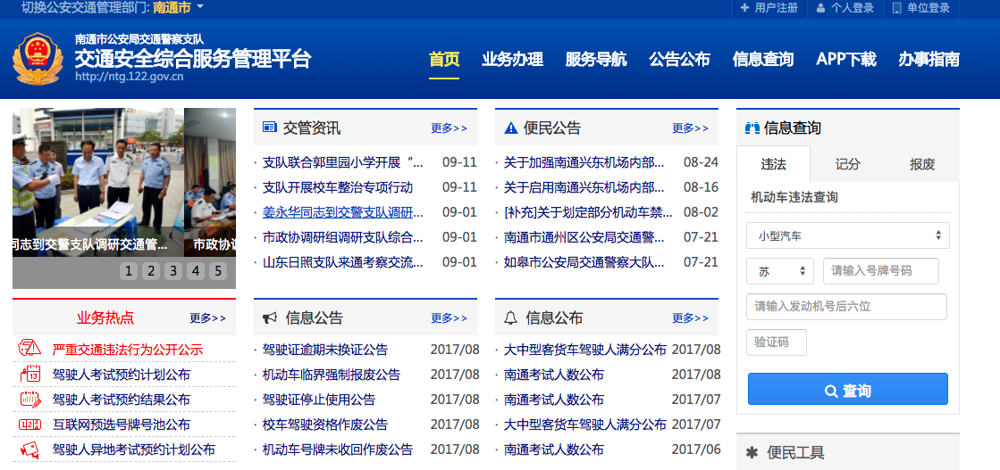
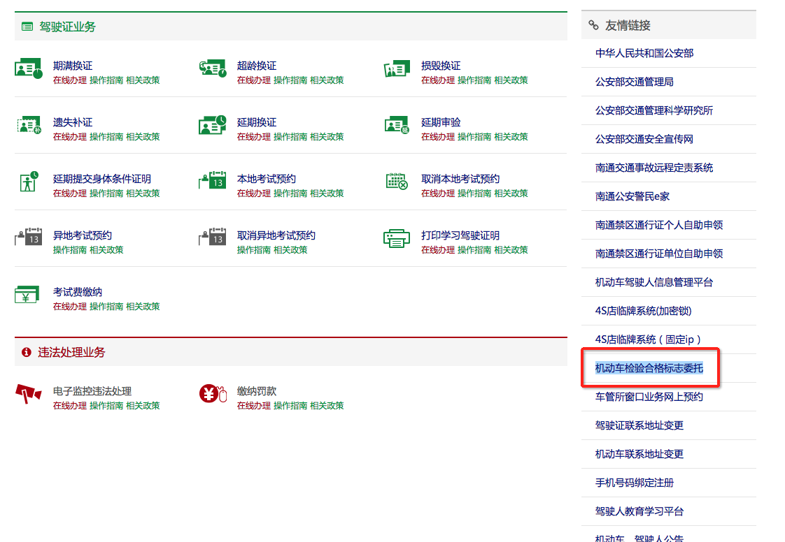
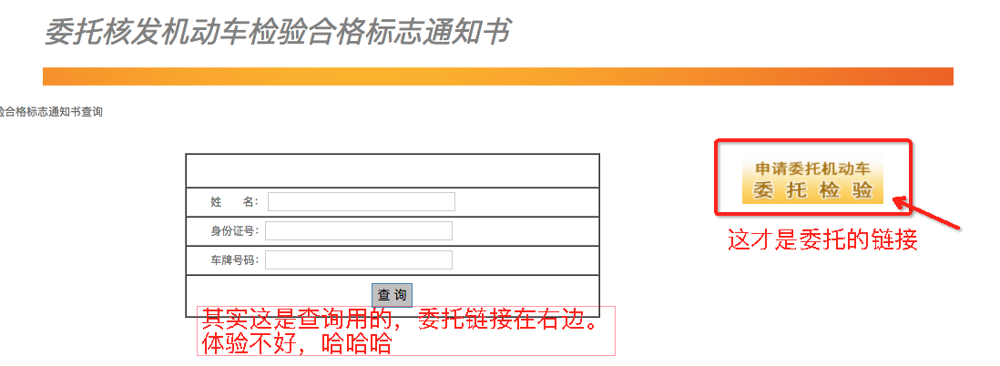
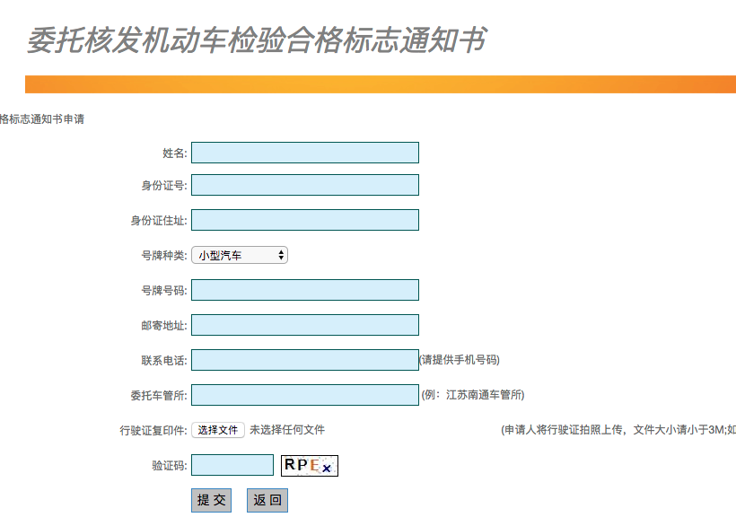

# 外地牌照（南通）在上海年检

>> 本文以南通牌照为例。

## 申请委托流程

1. 访问公安局交通警察支队的[交通安全综合服务管理平台 ntg.122.gov.cn](http://ntg.122.gov.cn/)。

2. 在首页的右下角有“友情链接”，然后找到“机动车检验合格标志委托”链接，点击进去。目前看是这个链接：http://218.91.210.226/Wt/Default.aspx

3. 链接进来看到如下图片，点右侧的图片

4. 进入委托表单，然后填写完之后，提示“提交成功，会尽快审核”的文案

> 注意受托地点 不要写“南通车管所”，我写的是我附近的一个监测站。“上海浦东新区汽车监测站”

5. 提交完之后，就可以返回前面查询的地方查询了。审核通过会邮寄到你填写的地址。
