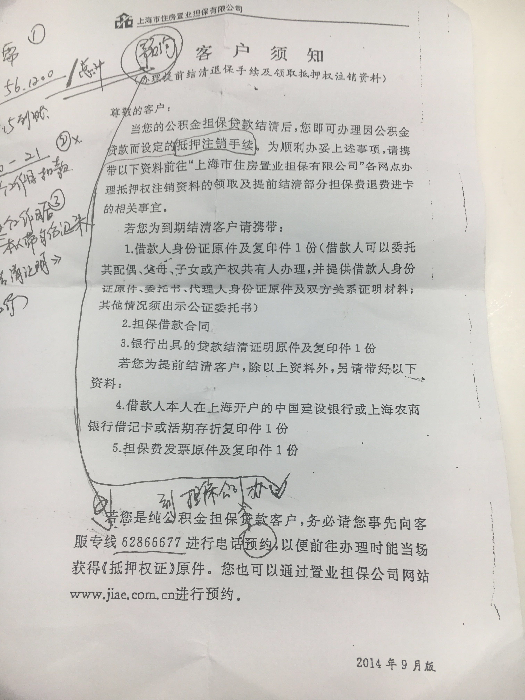

# 提前还贷

我是上海农商银行的公积金贷款，如下是农商银行的流程。

## 步骤
1. `主贷人`带`身份证`，去`贷款银行`申请提前还贷。

    这里的主贷人很明确，没什么问题。夫妻共同贷款的，只要去一个主贷人就行了。需要说明的是贷款银行，这不是随便去个该银行某个营业厅的。一定要去当时的贷款银行。比如我是在浦东的公积金贷款，一般都是去世纪大道1500号那边的农商银行。其他地方不行的。

    这个一步很快，其实就是去银行申请一下提前贷款，她会问你大概几号钱到账的。你要做的就是在那个时间点钱把钱到账即可。

1. 等钱到账后，银行会在__5__个工作日内扣款。同时你需要拨打担保公司的客服电话预约__抵押注销手续__（我的是62866677）。
1. 扣款后__2__个工作日，本人（主贷人）带身份证再去趟该银行办理__结清证明__。
1. 接着，在上面担保公司预约的时间内，去办理__抵押注销证明__，拿回《抵押权证》原件。我预约的内容大致如下：

    ```
    预约地址：浦东新区 南泉北路201号 11楼 
    预约时间：5-26 ～ 6-16
    工作时间：周一～周五 9:00 -11:30am  13:00 - 17:00 pm
    需要材料：
        1. 主贷人的`身份证`、`结清证明`、`农商卡`、`担保费发票`（以上是`原件`＋`复印件`）＋`借款合同`原件
        2. 如果是委托别人办理的话，带`主贷人和委托人的身份证`、`结婚证`、`银行卡`、`担保费发票`、（以上是`原件`＋`复印件`），`委托书`和`借款合同`原件。

    
    委托内容如下：

    主贷人 xxx 委托 xxx 办理房产抵押注销手续。
                                                            
                                                            主贷人 签字
                                                            日期
    

    办理完之后拿着《抵押注销证明》再去房产交易中心去办理抵押注销。
    联系电话：962269
    ```

    *PS: 如上担保费发票和借款合同不是必须的，有的话就带上，实在找不到也没关系的。若是委托办理那么在委托书里写清楚担保费发票遗失活着借款合同遗失即可。*

1. 最后，拿着抵押注销证明去趟房产交易中心办理注销房产抵押。

如下是我从农商银行拿过来的客户须知，仅供参考：




