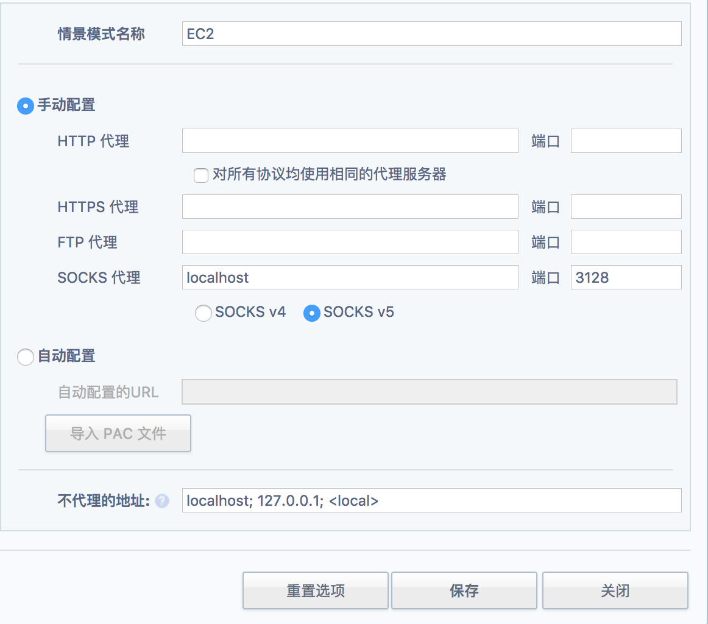

# 将Amazon的AWS（EC2）主机作为socks代理

作为开发，翻墙是经常需要的。习惯性的拿到一台新机器就会先配置翻墙。

我常用的翻墙就是通过Amazon的EC2主机提供代理。再通过Chrome的switchsharp插件就可以方便的实现翻墙。如果你连Chrome的插件都无法下载的话，那先建议你先用[GreenVPN](https://www.greenjsq.me/)把准备工作做完。GreenVPN首次注册可以免费用1天好像。速度还是不错的。

好了，长话短说，使用EC2翻墙的话分成3个步骤：

1. 拥有Amazon EC2主机服务。

    网上有详细的操作过程，我不再写了，可以参考[百度经验-亚马逊EC2 创建实例](http://jingyan.baidu.com/article/d2b1d102994da55c7e37d416.html)
    
    注意，这一步一定要拿到你的密钥文件，就是那个`.pem`结尾的文件。

1. 在本地建立sock代理

    通过ssh登陆EC2主机创建sock代理服务，运行命令如下：

    ```
    ssh -i "YOUR-EC2-KEY-FILE.pem" -CND 3128 ubuntu@EC2-SERVER-HOST-IP
    ```

    - `YOUR-EC2-KEY-FILE.pem`：你的密钥文件路径
    - `EC2-SERVER-HOST-IP`：你的EC2主机公网地址
    - `3128`：这是你sock代理的端口，你可以随便写一个端口都行。我这里用的3128。

1. 配置chrome，使用sock代理翻墙

    

参考：

- [Configuring a SOCKS Proxy for Amazon EC2](https://www.cloudera.com/documentation/director/latest/topics/director_security_socks.html)
- [GreenVPN](https://www.greenjsq.me/)
- [科学上网之EC2搭建shadowsocks](https://segmentfault.com/a/1190000003101075)